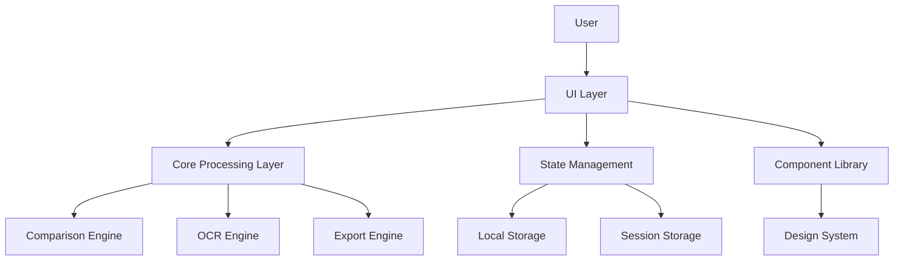
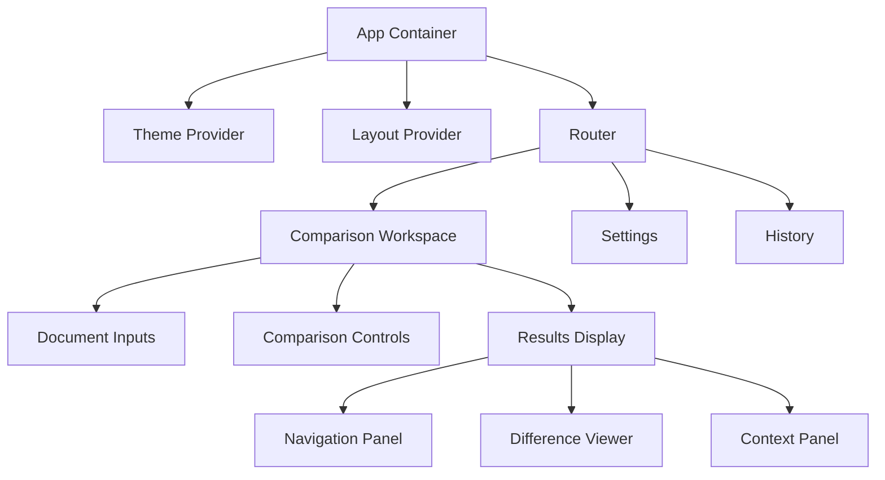
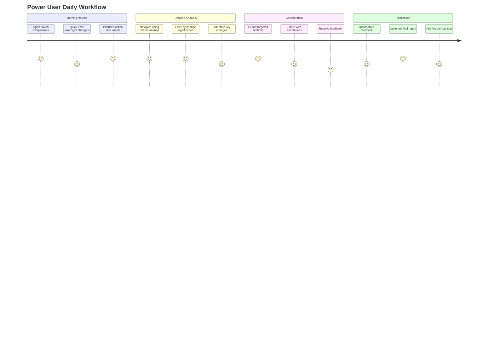

# Design Document: RdLn UI/UX Revolution

## Overview

The RdLn UI/UX Revolution represents a complete reimagining of the document comparison experience for legal professionals. This revolutionary design breaks entirely from traditional legal tech paradigms while maintaining the reliability and precision that legal work demands. The design document outlines a transformative approach that will position RdLn as the definitive next-generation legal comparison tool.

The design philosophy centers on four key principles:
1. **Radical Reinvention** - Completely breaking from the beige, utilitarian design of traditional legal tech
2. **Cognitive Harmony** - Fundamentally rethinking information presentation to minimize mental effort
3. **Engagement Architecture** - Building dopaminergic principles into every interaction layer
4. **Perceived Instantaneity** - Creating an experience that feels immediate regardless of document complexity

### Safety-First Implementation Strategy

While the design is revolutionary, the implementation follows a carefully controlled approach:
1. **Parallel Development Track** - Building the new experience alongside the existing system
2. **Comprehensive Testing Protocol** - Automated testing at all levels before any production deployment
3. **Feature Flag Deployment** - Gradual rollout with the ability to revert instantly
4. **Backward Compatibility Layer** - Ensuring critical functions remain available during transition
5. **SSMR Methodology** - Following the established Safe, Step-by-step, Modular, Reversible approach

## Architecture

### System Architecture Overview

The redesigned RdLn maintains its current technical architecture while implementing a new presentation layer that dramatically improves the user experience:



### UI Architecture

The UI architecture follows a component-based approach with a clear separation of concerns:



## Components and Interfaces

### Core Experience Components

#### 1. Document Input Interface

The document input interface is reimagined as a fluid, intuitive space that guides users through the document selection process:

- **Drag-and-Drop Zone**: A visually distinctive area with subtle animations that respond to user interaction
- **Document Preview Cards**: Thumbnail previews of uploaded documents with key metadata
- **Smart Defaults**: Intelligent labeling of "Original" and "Modified" documents based on metadata
- **OCR Status Integration**: Seamless indication of OCR processing without disrupting workflow
- **Format Support Indicators**: Clear visual cues for supported file types and conversion options

#### 2. Comparison Control Center

The comparison control center provides a streamlined interface for configuring comparison options:

- **Comparison Presets**: Quick-select options for common legal document comparison scenarios
- **Visual Settings Panel**: Intuitive controls for customizing how differences are displayed
- **Intelligent Defaults**: Context-aware suggestions based on document types and user history
- **Progressive Disclosure**: Advanced options available but not overwhelming the interface
- **Comparison Preview**: Miniature preview of how differences will be highlighted

#### 3. Results Navigation System

The results navigation system is redesigned to provide both overview and detail:

- **Document Map**: Visual representation of the entire document with change clusters highlighted
- **Smart Jump List**: Prioritized list of changes based on legal significance
- **Category Filters**: Quick-toggle filters for different types of changes (definitions, dates, etc.)
- **Context Preservation**: Navigation that maintains awareness of location within the document
- **Progress Tracking**: Visual indicators of which changes have been reviewed

#### 4. Difference Visualization

The difference visualization component moves beyond simple red/green highlighting:

- **Semantic Highlighting**: Different visual treatments for different types of changes
- **Change Significance Indicators**: Visual weighting of changes based on potential legal impact
- **Context Preservation**: Surrounding content visible for context with appropriate visual hierarchy
- **Inline Comments**: Ability to annotate specific changes with notes
- **Version Timeline**: Visual representation of document evolution for multiple comparisons

### Design System Components

#### 1. Typography System

A comprehensive typography system designed specifically for legal document comparison:

- **Primary Font**: [Lexend](https://www.lexend.com/) - A variable font designed for reading efficiency
- **Monospace Font**: [JetBrains Mono](https://www.jetbrains.com/lp/mono/) - Optimized for code and structured content
- **Variable Font Implementation**: Dynamic adjustment based on user preferences and context
- **Typographic Scale**: 1.2 ratio modular scale optimized for legal content
- **Readability Optimizations**: Line height, character spacing, and paragraph spacing tuned for legal text

#### 2. Color System

A sophisticated color system that moves beyond the traditional red/green while maintaining clarity:

- **Base Palette**: Rich, professional colors that avoid the "enterprise software" aesthetic
- **Semantic Colors**: Purpose-driven color assignments for different types of information
- **Accessibility Layers**: Color combinations tested for all forms of color vision deficiency
- **Theme Variants**: Light, dark, and high-contrast modes with consistent semantic meaning
- **Micro-Palette Generation**: Document-specific accent colors derived from company branding

#### 3. Component Library

A comprehensive component library that ensures consistency while providing flexibility:

- **Glass Panels**: Refined glassmorphism effects with appropriate depth and hierarchy
- **Action Buttons**: Distinctive, satisfying interactive elements with micro-animations
- **Status Indicators**: Clear, consistent status representations across the application
- **Navigation Elements**: Intuitive, spatially consistent navigation components
- **Form Controls**: Refined input elements optimized for legal professional workflows
- **Data Visualizations**: Specialized components for representing document statistics and changes

## Data Models

### User Preference Model

```typescript
interface UserPreferences {
  theme: 'light' | 'dark' | 'high-contrast' | 'custom';
  customTheme?: ThemeConfiguration;
  textSize: 'small' | 'medium' | 'large' | 'x-large';
  lineSpacing: 'compact' | 'standard' | 'comfortable';
  diffHighlightStyle: 'standard' | 'subtle' | 'pronounced' | 'semantic';
  navigationPreferences: {
    showDocumentMap: boolean;
    prioritizeChangeTypes: ChangeType[];
    autoExpandContext: boolean;
    rememberScrollPosition: boolean;
  };
  performancePreferences: {
    chunkSize: number;
    preloadStrategy: 'aggressive' | 'balanced' | 'minimal';
    animationLevel: 'full' | 'reduced' | 'minimal';
  };
  accessibilityPreferences: {
    reduceMotion: boolean;
    highContrast: boolean;
    keyboardNavigation: 'standard' | 'enhanced';
  };
}
```

### Document Comparison Model

```typescript
interface DocumentComparison {
  id: string;
  originalDocument: {
    id: string;
    name: string;
    type: DocumentType;
    content: string;
    metadata: DocumentMetadata;
  };
  modifiedDocument: {
    id: string;
    name: string;
    type: DocumentType;
    content: string;
    metadata: DocumentMetadata;
  };
  comparisonSettings: {
    ignoreWhitespace: boolean;
    ignoreFormatting: boolean;
    ignoreCase: boolean;
    customRules: ComparisonRule[];
  };
  comparisonResults: {
    differences: Difference[];
    summary: ComparisonSummary;
    chunks: ComparisonChunk[];
  };
  userAnnotations: {
    notes: Note[];
    highlights: Highlight[];
    resolutions: Resolution[];
  };
  timestamp: Date;
  lastViewed: Date;
}
```

### Difference Visualization Model

```typescript
interface Difference {
  id: string;
  type: 'addition' | 'deletion' | 'modification' | 'formatting' | 'structural';
  originalContent?: string;
  modifiedContent?: string;
  originalRange: Range;
  modifiedRange: Range;
  significance: 'critical' | 'major' | 'minor' | 'formatting';
  category?: 'definition' | 'date' | 'party' | 'amount' | 'obligation' | 'condition' | 'term';
  relatedDifferences: string[]; // IDs of related differences
  context: {
    before: string;
    after: string;
  };
  reviewed: boolean;
  annotations: string[]; // IDs of annotations
}
```

## Error Handling

### User-Facing Error Strategy

The error handling strategy prioritizes maintaining user confidence and workflow continuity:

1. **Graceful Degradation**: Components fail independently without crashing the application
2. **Contextual Recovery Options**: Error messages include specific actions users can take
3. **State Preservation**: User data and state are preserved during error recovery
4. **Visual Consistency**: Error states maintain the design language of the application
5. **Proactive Prevention**: Input validation and system checks prevent common errors

### Error Categories and Responses

| Error Category | Visual Treatment | User Action Options | Background Recovery |
|----------------|------------------|---------------------|---------------------|
| Document Format | Subtle warning with format details | Convert, Re-upload, Proceed with limitations | Attempt auto-conversion |
| Processing Timeout | Progress indicator with options | Process in chunks, Simplify comparison, Adjust settings | Adaptive chunk sizing |
| OCR Challenges | Quality indicator with specific issues | Manual correction, Proceed with limitations, Adjust OCR settings | Background reprocessing |
| Memory Constraints | Resource monitor with optimization options | Reduce document scope, Adjust comparison detail, Close other applications | Aggressive garbage collection |
| Network Issues (for integrations) | Connection status with offline options | Work locally, Retry connection, Save for later sync | Background reconnection attempts |

## Testing Strategy

### Competitive Differentiation Strategy

RdLn's key advantages over incumbent solutions:

**vs. Litera Compare:**
- **Instant Startup**: Web-based with <2 second load time vs. Litera's 30+ second desktop startup
- **Modern Interface**: Revolutionary UI vs. outdated enterprise aesthetic
- **Cross-Platform**: Works on any device vs. Windows-only desktop application
- **Privacy-First**: Client-side processing vs. potential data exposure in enterprise environments
- **Affordable Pricing**: Subscription model accessible to solo practitioners vs. expensive enterprise licensing

**vs. Draftable:**
- **True Privacy**: Client-side processing vs. server uploads
- **Advanced OCR**: 50+ language support vs. basic OCR capabilities
- **Offline Capability**: Full functionality without internet vs. web-only dependency
- **Legal-Optimized**: Purpose-built for legal workflows vs. generic document comparison
- **Superior Visualization**: Semantic highlighting and context preservation vs. basic red/green highlighting

### Usability Testing

A comprehensive usability testing strategy focusing on competitive benchmarking:

1. **Head-to-Head Comparison Studies**: Direct task completion comparisons with Litera and Draftable
2. **Speed Benchmarking**: Measure time-to-completion for common legal comparison tasks
3. **Cognitive Load Assessment**: Eye-tracking studies comparing mental effort across platforms
4. **Satisfaction Metrics**: Net Promoter Score and user preference studies
5. **Switching Cost Analysis**: Measure ease of adoption for users migrating from incumbent solutions

### Performance Testing

Performance testing focused on both technical metrics and perceived performance:

1. **Document Size Scaling**: Performance with increasingly large legal documents
2. **Interaction Responsiveness**: Measurement of time between user action and system response
3. **Memory Consumption Patterns**: Analysis of memory usage during extended sessions
4. **Perceived Performance Metrics**: User perception of speed vs. actual processing time
5. **Device Compatibility Testing**: Performance across different hardware capabilities

### Accessibility Testing

Comprehensive accessibility testing to ensure inclusivity:

1. **Screen Reader Compatibility**: Testing with JAWS, NVDA, and VoiceOver
2. **Keyboard Navigation Efficiency**: Measurement of task completion using keyboard only
3. **Color Contrast Analysis**: Testing across all color vision deficiency types
4. **Motion Sensitivity Testing**: Evaluation with users sensitive to motion
5. **Cognitive Accessibility Review**: Assessment of clarity and cognitive load

## Implementation Considerations

### Revolutionary Implementation with Safety Controls

The implementation will follow a revolutionary approach with robust safety controls:

1. **Parallel Development Stream**: Build the new experience in a separate branch without affecting production
2. **Core Engine Preservation**: Maintain the proven comparison and OCR engines while rebuilding the interface
3. **Comprehensive Test Suite**: Develop extensive automated tests before any production deployment
4. **Phased Feature Flag Rollout**: Deploy changes incrementally with instant rollback capability
5. **User Experience Monitoring**: Implement analytics to detect any usability issues immediately
6. **Performance Safeguards**: Build in resource monitoring and automatic optimization

### Browser and Device Support

The application will support:

- **Desktop Browsers**: Chrome, Firefox, Safari, Edge (latest 2 versions)
- **Mobile Browsers**: Safari iOS, Chrome for Android (latest 2 versions)
- **Tablet Support**: Optimized layouts for iPad and Android tablets
- **Responsive Breakpoints**: 320px, 768px, 1024px, 1440px, 1920px

### Performance Budgets

Strict performance budgets will be enforced:

- **Initial Load**: < 2 seconds on standard broadband
- **Time to Interactive**: < 3 seconds
- **Input Responsiveness**: < 100ms response to user input
- **Scrolling Performance**: 60fps during document navigation
- **Memory Usage**: < 500MB for standard documents, graceful degradation above that

## Visual Design Direction

### Interface Revolution

The visual design direction represents a complete paradigm shift in legal tech interfaces while maintaining professional credibility:

1. **From Utilitarian to Experiential**: Transforming the interface from purely functional to emotionally resonant
2. **From Dense to Contextual**: Replacing information overload with intelligent, context-aware presentation
3. **From Static to Fluid**: Introducing dynamic, responsive layouts that adapt to user behavior and needs
4. **From Generic to Signature**: Establishing a distinctive visual language that becomes instantly recognizable

### Key Visual Elements

The key visual elements that define the new RdLn experience:

1. **Layered Transparency**: Refined glassmorphism that creates depth without distraction
2. **Purposeful Animation**: Subtle motion that guides attention and provides feedback
3. **Spatial Consistency**: Thoughtful layout that maintains relationships between elements
4. **Visual Hierarchy**: Clear distinction between different levels of information importance
5. **Whitespace Utilization**: Strategic use of negative space to reduce cognitive load

### Design Mockups

The following key screens illustrate the visual direction:

1. **Document Input Screen**: Clean, focused interface for document selection
2. **Comparison Configuration**: Intuitive controls with visual previews
3. **Results Overview**: Document map with change clustering and navigation
4. **Detailed Comparison View**: Side-by-side view with enhanced difference visualization
5. **Mobile Comparison Experience**: Optimized interface for smaller screens

## User Journey Maps

### New User Journey


### Power User Journey



## Conclusion

This design document outlines a revolutionary approach to completely reimagining the legal document comparison experience. By embracing radical reinvention, cognitive harmony, engagement architecture, and perceived instantaneity, RdLn will fundamentally transform how legal professionals interact with document comparison tools.

The implementation strategy balances revolutionary design with uncompromising reliability. By utilizing parallel development tracks, comprehensive testing protocols, and feature flag deployment, we ensure zero disruption to critical workflows while delivering a transformative experience. This "revolution with safety rails" approach allows us to push boundaries while maintaining the trust of legal professionals who depend on RdLn for mission-critical work.

The result will be a legal tech product that not only surpasses incumbent solutions in functionality but creates an emotional connection with users through thoughtful design and interaction. RdLn will set a new standard for what legal professionals should expect from their tools—proving that legal tech can be both powerful and pleasurable to use.