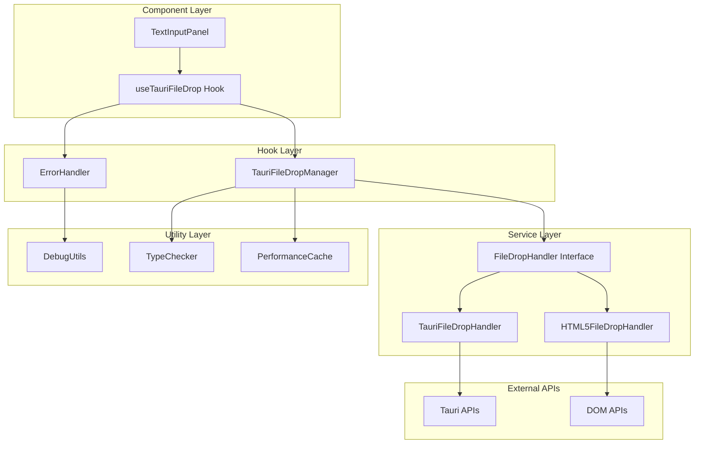

# Design Document

## Overview

This design transforms the current Tauri file drop implementation from a working but architecturally problematic solution into a robust, maintainable, and testable system. The refactoring addresses global state management issues, component coupling, type safety concerns, and performance optimization while maintaining full backward compatibility.

The design follows React best practices with proper separation of concerns, custom hooks for reusable logic, class-based state management, and comprehensive TypeScript interfaces. The architecture supports both Tauri and web environments through abstraction layers.

## Architecture

### High-Level Architecture



### Component Architecture

The refactored architecture separates concerns into distinct layers:

1. **Component Layer**: Pure UI components focused on rendering
2. **Hook Layer**: Custom hooks encapsulating business logic
3. **Service Layer**: Abstract interfaces with concrete implementations
4. **Utility Layer**: Shared utilities for debugging, caching, and type checking

## Components and Interfaces

### 1. FileDropHandler Interface

```typescript
interface FileDropHandler {
  setup(onFileDrop: FileDropCallback): Promise<void>;
  cleanup(): void;
  reset(): void;
  isSupported(): boolean;
}

interface FileDropCallback {
  (file: File, target: Element, metadata: FileDropMetadata): Promise<void>;
}

interface FileDropMetadata {
  position: { x: number; y: number };
  timestamp: number;
  source: 'tauri' | 'html5';
}
```

### 2. TauriFileDropManager Class

```typescript
class TauriFileDropManager {
  private isSetup: boolean = false;
  private lastProcessedFile: string | null = null;
  private lastProcessedTime: number = 0;
  private cleanup?: () => void;
  private panelCache = new WeakMap<Element, string>();
  
  async setup(onFileDrop: FileDropCallback): Promise<void>
  cleanup(): void
  reset(): void
  private processFileForPanel(file: string, target: Element): Promise<void>
  private findTargetPanel(position: Position): Element | null
  private isDuplicateFile(filePath: string): boolean
}
```

### 3. useTauriFileDrop Custom Hook

```typescript
interface UseTauriFileDropOptions {
  onFileProcessed: (file: File) => Promise<void>;
  onError?: (error: TauriFileDropError) => void;
  enabled?: boolean;
}

interface UseTauriFileDropReturn {
  isSetup: boolean;
  error: TauriFileDropError | null;
  reset: () => void;
}

function useTauriFileDrop(
  title: string, 
  options: UseTauriFileDropOptions
): UseTauriFileDropReturn
```

### 4. Error Handling System

```typescript
class TauriFileDropError extends Error {
  constructor(
    message: string,
    public code: TauriFileDropErrorCode,
    public context?: Record<string, any>
  ) {
    super(message);
    this.name = 'TauriFileDropError';
  }
}

enum TauriFileDropErrorCode {
  SETUP_FAILED = 'SETUP_FAILED',
  FILE_READ_FAILED = 'FILE_READ_FAILED',
  OCR_PROCESSING_FAILED = 'OCR_PROCESSING_FAILED',
  TARGET_NOT_FOUND = 'TARGET_NOT_FOUND',
  DUPLICATE_FILE = 'DUPLICATE_FILE'
}
```

### 5. Type Safety Interfaces

```typescript
interface TauriFileDropEvent {
  payload: {
    paths: string[];
    position: { x: number; y: number };
  };
}

interface TauriAPIs {
  listen: (
    event: string, 
    handler: (event: TauriFileDropEvent) => void
  ) => Promise<() => void>;
  readFile: (path: string) => Promise<Uint8Array>;
}

interface ComponentInstance {
  id: string;
  title: string;
  element: Element;
  mounted: boolean;
}
```

## Data Models

### FileDropState

```typescript
interface FileDropState {
  isSetup: boolean;
  activeInstances: Map<string, ComponentInstance>;
  lastProcessedFile: string | null;
  lastProcessedTime: number;
  error: TauriFileDropError | null;
}
```

### PerformanceCache

```typescript
interface PerformanceCache {
  panelQueries: WeakMap<Element, string>;
  fileTypeChecks: Map<string, boolean>;
  positionCalculations: Map<string, Element>;
}
```

### DebugContext

```typescript
interface DebugContext {
  instanceId: string;
  operation: string;
  timestamp: number;
  metadata: Record<string, any>;
}
```

## Error Handling

### Centralized Error Strategy

```typescript
class ErrorHandler {
  static handle(error: unknown, context: DebugContext): TauriFileDropError {
    const tauriError = this.wrapError(error, context);
    this.logError(tauriError, context);
    this.reportError(tauriError, context);
    return tauriError;
  }
  
  private static wrapError(error: unknown, context: DebugContext): TauriFileDropError {
    if (error instanceof TauriFileDropError) return error;
    
    const message = error instanceof Error ? error.message : String(error);
    return new TauriFileDropError(
      message,
      this.inferErrorCode(error, context),
      { originalError: error, context }
    );
  }
}
```

### Error Recovery Mechanisms

1. **Graceful Degradation**: Fall back to HTML5 drag-drop when Tauri APIs fail
2. **Retry Logic**: Automatic retry for transient failures
3. **State Reset**: Clean state reset on critical errors
4. **User Feedback**: Clear error messages with actionable suggestions

## Testing Strategy

### Unit Testing Approach

```typescript
// Mock Tauri APIs for testing
const mockTauriAPIs = {
  listen: jest.fn(),
  readFile: jest.fn()
};

// Test TauriFileDropManager in isolation
describe('TauriFileDropManager', () => {
  let manager: TauriFileDropManager;
  
  beforeEach(() => {
    manager = new TauriFileDropManager();
    manager.reset();
  });
  
  it('should setup file drop listener', async () => {
    const callback = jest.fn();
    await manager.setup(callback);
    expect(manager.isSetup).toBe(true);
  });
});
```

### Integration Testing

```typescript
// Test useTauriFileDrop hook with React Testing Library
describe('useTauriFileDrop', () => {
  it('should handle file drop events', async () => {
    const onFileProcessed = jest.fn();
    const { result } = renderHook(() => 
      useTauriFileDrop('Test Panel', { onFileProcessed })
    );
    
    // Simulate file drop event
    await act(async () => {
      // Trigger file drop
    });
    
    expect(onFileProcessed).toHaveBeenCalled();
  });
});
```

### Performance Testing

```typescript
describe('Performance', () => {
  it('should cache DOM queries', () => {
    const manager = new TauriFileDropManager();
    const element = document.createElement('div');
    
    // First query should cache result
    manager.findTargetPanel({ x: 100, y: 100 });
    
    // Second query should use cache
    const startTime = performance.now();
    manager.findTargetPanel({ x: 100, y: 100 });
    const endTime = performance.now();
    
    expect(endTime - startTime).toBeLessThan(1); // Should be very fast
  });
});
```

## Implementation Details

### Phase 1: Extract Custom Hook

**Goal**: Move Tauri logic from TextInputPanel to useTauriFileDrop hook

**Changes**:
- Create `src/hooks/useTauriFileDrop.ts`
- Extract all Tauri-related logic from TextInputPanel
- Maintain existing functionality during transition
- Add proper TypeScript interfaces

**Benefits**:
- Improved testability
- Cleaner component code
- Reusable hook for other components

### Phase 2: Create Manager Class

**Goal**: Replace global variables with proper class-based state management

**Changes**:
- Create `src/services/TauriFileDropManager.ts`
- Replace module-level variables with class properties
- Add proper cleanup and reset methods
- Implement singleton pattern for global access

**Benefits**:
- Predictable state management
- Memory leak prevention
- Better debugging capabilities

### Phase 3: Improve Type Safety

**Goal**: Add comprehensive TypeScript interfaces for all Tauri interactions

**Changes**:
- Create `src/types/tauri-file-drop.ts`
- Define interfaces for all Tauri APIs
- Remove all `any` types
- Add runtime type checking where needed

**Benefits**:
- Compile-time error detection
- Better IDE support
- Safer refactoring

### Phase 4: Add Error Boundaries

**Goal**: Implement comprehensive error handling strategy

**Changes**:
- Create `src/utils/TauriFileDropError.ts`
- Add centralized error handling
- Implement error boundaries for Tauri-specific errors
- Add user-friendly error messages

**Benefits**:
- Better error debugging
- Graceful error recovery
- Improved user experience

### Phase 5: Performance Optimization

**Goal**: Optimize performance through caching and cleanup

**Changes**:
- Implement DOM query caching
- Add memoization for expensive operations
- Ensure proper cleanup of all resources
- Add performance monitoring

**Benefits**:
- Reduced CPU usage
- Better memory management
- Improved responsiveness

## Migration Strategy

### Backward Compatibility

The refactoring maintains full backward compatibility:

1. **Existing API**: All existing component props and methods remain unchanged
2. **Gradual Migration**: Components can be migrated one at a time
3. **Feature Flags**: New architecture can be enabled/disabled via feature flags
4. **Fallback Support**: Automatic fallback to current implementation if new system fails

### Rollback Plan

If issues arise during migration:

1. **Feature Flag Disable**: Instantly disable new architecture
2. **Component Rollback**: Roll back individual components to previous implementation
3. **State Preservation**: Maintain user state during rollback
4. **Error Reporting**: Comprehensive error reporting for debugging

## Performance Considerations

### Memory Management

- **WeakMap Usage**: Use WeakMaps for DOM element caching to prevent memory leaks
- **Event Listener Cleanup**: Proper cleanup of all event listeners on component unmount
- **State Reset**: Regular state cleanup to prevent memory accumulation

### CPU Optimization

- **DOM Query Caching**: Cache expensive DOM queries using WeakMap
- **Memoization**: Memoize file type checks and other expensive operations
- **Debouncing**: Debounce rapid file drop events to prevent processing overload

### Network Optimization

- **File Deduplication**: Prevent processing the same file multiple times
- **Batch Processing**: Process multiple files in batches when possible
- **Progress Tracking**: Provide accurate progress feedback for long operations

## Security Considerations

### File Validation

- **Type Checking**: Strict file type validation before processing
- **Size Limits**: Enforce reasonable file size limits
- **Path Sanitization**: Sanitize file paths to prevent directory traversal

### Error Information

- **Sensitive Data**: Ensure error messages don't leak sensitive information
- **Stack Traces**: Filter stack traces in production builds
- **Logging**: Secure logging that doesn't expose internal details

This design provides a robust foundation for the Tauri file drop refactoring while maintaining the existing functionality and user experience.