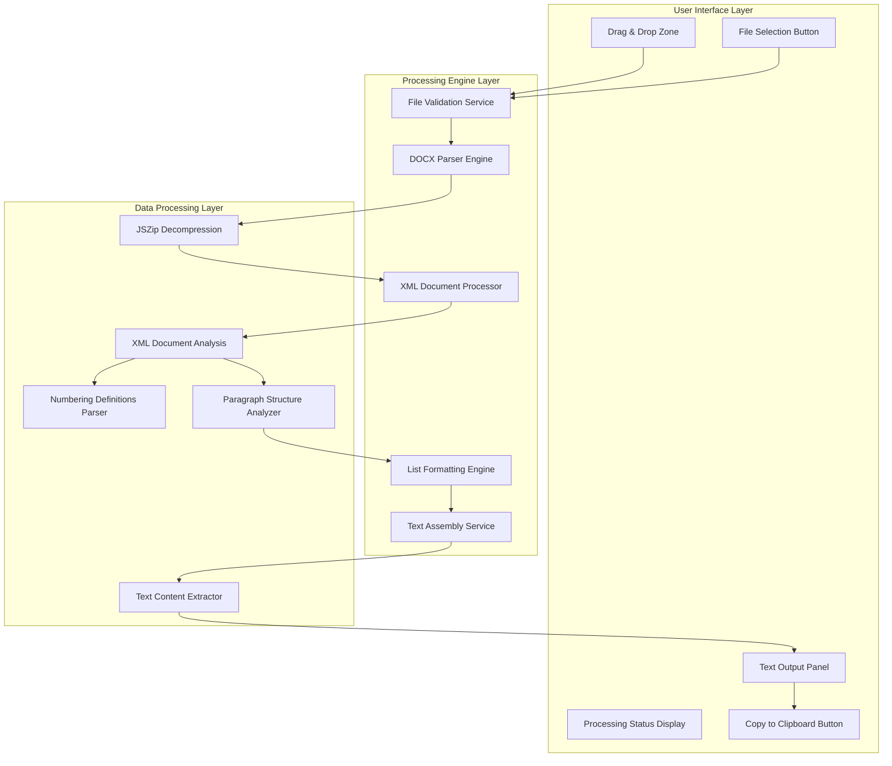

# DOCX Text Extraction Prototype Design Document

## Overview

This document outlines the design for a minimal exploratory DOCX text extraction prototype that implements drag-and-drop file upload, comprehensive text extraction with proper formatting preservation, clipboard integration, and visual feedback. The solution must faithfully preserve line breaks, paragraph structure, and all list formatting (numbered, unnumbered, and nested) to achieve the same result as copying from Microsoft Word to a plain text editor.

## Technology Stack & Dependencies

### Core Technologies
- **HTML5/CSS3**: Modern web standards for UI and drag-drop functionality
- **Vanilla JavaScript (ES6+)**: No framework dependencies for maximum compatibility
- **JSZip Library**: DOCX file decompression and XML extraction
- **DOM Parser**: Native browser XML parsing capabilities
- **Clipboard API**: Modern browser clipboard integration

### External Dependencies
- JSZip v3.10.1+ (CDN: `https://cdn.jsdelivr.net/npm/jszip@3.10.1/dist/jszip.min.js`)
- No server-side dependencies (100% client-side processing)

### Browser Compatibility
- Modern browsers supporting ES6+, Drag & Drop API, and Clipboard API
- Chrome 66+, Firefox 63+, Safari 13.1+, Edge 79+

## Architecture

### System Architecture Overview

The prototype follows a modular, client-side architecture with clear separation of concerns:



### Component Architecture

#### 1. File Input Handler
**Responsibility**: Manage file upload through drag-drop and file selection
- Drag and drop event handling
- File type validation (DOCX only)
- File size validation and error handling
- User feedback during file selection

#### 2. DOCX Processing Engine
**Responsibility**: Core text extraction with formatting preservation
- ZIP file decompression using JSZip
- XML document parsing and analysis
- Numbering schema extraction and interpretation
- List formatting reconstruction

#### 3. Text Assembly Service
**Responsibility**: Reconstruct formatted text output
- Paragraph structure preservation
- Line break and spacing maintenance
- List prefix generation and nesting
- Final text compilation

#### 4. Clipboard Integration Service
**Responsibility**: Handle clipboard operations
- Modern Clipboard API implementation
- Fallback for older browsers
- User feedback and error handling

## Implementation Strategies

### Strategy A: Direct XML Parsing with Complete Numbering Support

**Approach**: Parse DOCX XML structure directly for maximum control over formatting preservation.

#### Key Components:
1. **ZIP Decompression**: Extract `word/document.xml`, `word/numbering.xml`, `word/styles.xml`
2. **Numbering Schema Parser**: Complete interpretation of Word's numbering definitions
3. **List State Manager**: Track nested list counters and formatting
4. **Paragraph Processor**: Preserve paragraph breaks and spacing

#### Technical Implementation:
```javascript
class DocxXmlParser {
    static async extractWithProperLists(file) {
        // 1. Validate DOCX format
        // 2. Extract XML files using JSZip
        // 3. Parse numbering definitions
        // 4. Process paragraphs with list context
        // 5. Reconstruct formatted text
    }
}
```

#### Advantages:
- Complete control over formatting interpretation
- Accurate list numbering (decimal, roman, letters)
- Proper nested list handling
- No dependency on external text extraction libraries

#### Disadvantages:
- More complex implementation
- Requires deep understanding of DOCX structure
- Higher maintenance overhead

### Strategy B: Hybrid XML + Text Pattern Recognition

**Approach**: Combine basic XML parsing with intelligent pattern recognition for list formatting.

#### Key Components:
1. **Basic XML Parser**: Extract text content from `w:t` elements
2. **Pattern Recognition Engine**: Identify list patterns in extracted text
3. **Formatting Reconstructor**: Apply consistent list formatting
4. **Structure Analyzer**: Preserve paragraph and line breaks

#### Technical Implementation:
```javascript
class HybridDocxParser {
    static async extractWithPatternRecognition(file) {
        // 1. Extract raw text from XML
        // 2. Analyze paragraph structure
        // 3. Apply pattern recognition for lists
        // 4. Reconstruct formatting
    }
}
```

#### Advantages:
- Simpler implementation than full XML parsing
- Good balance of accuracy and complexity
- Faster processing for simple documents
- More resilient to DOCX variations

#### Disadvantages:
- May miss complex nested structures
- Pattern recognition can be error-prone
- Limited handling of custom numbering formats

### Strategy C: Minimalist Text Extraction with Post-Processing

**Approach**: Extract raw text and apply intelligent post-processing for formatting.

#### Key Components:
1. **Simple Text Extractor**: Basic text extraction from DOCX
2. **Line Break Preservator**: Maintain document structure
3. **List Pattern Detector**: Identify and format list items
4. **Text Normalizer**: Clean and format final output

#### Advantages:
- Simplest implementation
- Fastest processing
- Most reliable for basic documents
- Easy to debug and maintain

#### Disadvantages:
- Limited formatting preservation
- May lose complex list structures
- Less accurate than XML-based approaches

## Core Features Implementation

### Drag & Drop Interface

#### UI Design Requirements:
- Large, visually distinct drop zone (minimum 300x200px)
- Clear visual feedback during drag operations
- File type validation with immediate user feedback
- Progress indicators during processing

#### Technical Implementation:
```javascript
class DragDropHandler {
    constructor(dropZone) {
        this.dropZone = dropZone;
        this.setupEventListeners();
    }
    
    setupEventListeners() {
        // Prevent default browser behavior
        // Add visual feedback for drag operations
        // Handle file drop with validation
    }
}
```

### Text Extraction Engine

#### Processing Pipeline:
1. **File Validation**: Verify DOCX format and size limits
2. **ZIP Decompression**: Extract XML content using JSZip
3. **XML Analysis**: Parse document structure and numbering
4. **Text Assembly**: Reconstruct formatted text with preserved structure
5. **Output Generation**: Prepare final text for display and clipboard

#### List Formatting Preservation:
- **Numbered Lists**: Support for decimal (1, 2, 3), roman (i, ii, iii), and alphabetic (a, b, c)
- **Bullet Lists**: Preserve bullet characters and indentation
- **Nested Lists**: Maintain hierarchy and proper indentation
- **Custom Formats**: Handle parentheses, periods, and other delimiters

### Clipboard Integration

#### Implementation Strategy:
```javascript
class ClipboardService {
    static async copyToClipboard(text) {
        if (navigator.clipboard && window.isSecureContext) {
            // Modern Clipboard API
            await navigator.clipboard.writeText(text);
        } else {
            // Fallback for older browsers
            this.fallbackCopyToClipboard(text);
        }
    }
}
```

#### Features:
- Modern Clipboard API for secure contexts
- Fallback implementation for compatibility
- User feedback and error handling
- Success/failure notifications

### Visual Feedback System

#### Processing Status Display:
- File upload confirmation
- Processing progress indication
- Error message display with actionable guidance
- Success confirmation with extracted content preview

#### UI Components:
- Status indicator with progress animation
- File information display (name, size, type)
- Error alerts with specific troubleshooting guidance
- Success notifications with processing metrics

## Data Models & File Structure

### DOCX File Structure Analysis

#### Key XML Files:
- **`word/document.xml`**: Main document content and structure
- **`word/numbering.xml`**: List numbering definitions and formats
- **`word/styles.xml`**: Document styling information
- **`word/_rels/document.xml.rels`**: Relationship definitions

#### XML Element Mapping:
```xml
<!-- Paragraph with numbering -->
<w:p>
    <w:pPr>
        <w:numPr>
            <w:ilvl w:val="0"/>  <!-- List level -->
            <w:numId w:val="1"/> <!-- Numbering ID -->
        </w:numPr>
    </w:pPr>
    <w:r>
        <w:t>List item text</w:t>
    </w:r>
</w:p>
```

### Numbering Definition Structure

#### Abstract Numbering:
- **Format Types**: decimal, lowerLetter, upperLetter, lowerRoman, upperRoman, bullet
- **Level Definitions**: indentation, text patterns, starting values
- **Styling Properties**: font, alignment, spacing

#### Concrete Numbering:
- **Numbering Instance**: Maps abstract definitions to document usage
- **Level Overrides**: Document-specific modifications
- **Restart Sequences**: Numbering continuation and reset points

## Testing Strategy

### Unit Testing Approach

#### Test Categories:
1. **File Validation Tests**: DOCX format verification, error handling
2. **XML Parsing Tests**: Document structure analysis, numbering extraction
3. **Text Assembly Tests**: Formatting preservation, line break handling
4. **List Formatting Tests**: All numbering formats, nested structures
5. **Clipboard Integration Tests**: Copy functionality, browser compatibility

#### Test Document Requirements:
- Simple text documents (baseline functionality)
- Complex nested lists (3+ levels deep)
- Mixed formatting (numbered + bulleted lists)
- Large documents (performance testing)
- Edge cases (empty lists, custom formats)

### Integration Testing

#### Browser Compatibility Testing:
- Chrome, Firefox, Safari, Edge on desktop platforms
- Modern mobile browsers (iOS Safari, Chrome Mobile)
- Drag & drop functionality across browsers
- Clipboard API compatibility testing

#### Performance Testing:
- Large DOCX files (1MB+ documents)
- Complex document structures (100+ list items)
- Memory usage monitoring
- Processing time benchmarks

### Manual Testing Procedures

#### Validation Workflow:
1. Create test DOCX in Microsoft Word with comprehensive formatting
2. Copy content manually from Word to plain text editor
3. Process same file through prototype
4. Compare outputs for accuracy
5. Verify list formatting, line breaks, and structure preservation

## Performance Optimization

### Memory Management
- Efficient ZIP decompression with stream processing
- XML parsing with minimal DOM tree retention
- Garbage collection-friendly object lifecycle management
- Large document handling with chunked processing

### Processing Efficiency
- Lazy loading of non-essential XML files
- Caching of numbering definitions for repeated use
- Optimized regular expressions for pattern matching
- Minimal DOM manipulation for better performance

### User Experience Optimization
- Asynchronous processing with progress feedback
- Non-blocking UI during file processing
- Responsive design for various screen sizes
- Accessible keyboard navigation and screen reader support

## Security and Privacy

### Client-Side Processing Benefits
- No server uploads required (complete privacy)
- No data transmission or storage
- GDPR and privacy regulation compliance
- Reduced attack surface (no server-side vulnerabilities)

### Input Validation
- Strict DOCX format verification
- File size limits (default: 10MB max)
- ZIP bomb protection with extraction limits
- Malformed XML handling with graceful degradation

### Browser Security
- Content Security Policy compliance
- XSS prevention through proper data sanitization
- Secure clipboard API usage with fallback handling
- No external script dependencies beyond CDN resources

## File Structure

### Project Organization
```
Prototypes/DOCX_Input_Prototype_by_Qoder_B/
├── index.html                    # Main prototype application
├── styles.css                    # UI styling and layout
├── scripts/
│   ├── main.js                   # Application entry point
│   ├── docx-parser.js           # Core DOCX processing engine
│   ├── drag-drop.js             # File upload handling
│   ├── clipboard.js             # Clipboard integration
│   └── ui-manager.js            # User interface management
├── assets/
│   └── icons/                   # UI icons and graphics
├── test-files/                  # Sample DOCX files for testing
│   ├── simple-text.docx
│   ├── numbered-lists.docx
│   ├── nested-lists.docx
│   └── complex-formatting.docx
└── README.md                    # Usage instructions and documentation
```

### Implementation Files

#### Core Implementation (index.html)
- Complete self-contained HTML application
- Embedded CSS and JavaScript for portability
- CDN dependencies for external libraries
- Responsive design with modern UI patterns

#### Modular Components (Alternative Structure)
- Separated JavaScript modules for maintainability
- CSS modules for styling organization
- Asset optimization for production deployment
- Development vs. production configurations