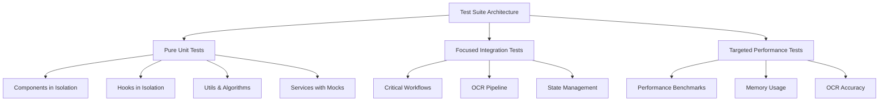
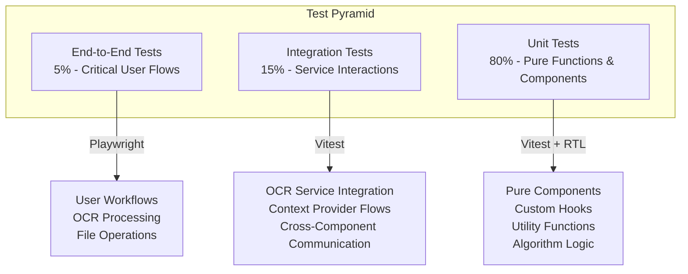
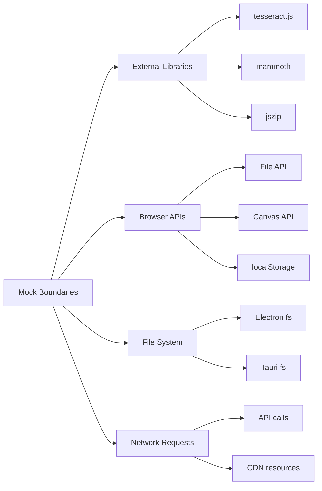

# Test Suite Overhaul Design

## Overview

This design outlines a complete overhaul of the RdLn test suite, transitioning from the current fragmented testing approach to a clean, targeted, and maintainable unit testing strategy. The current test suite suffers from multiple architectural issues including improper context provider handling, unreliable test logic, timeout problems, and poor test organization that makes maintenance difficult.

## Current State Analysis

### Identified Problems
- **Context Provider Issues**: Tests fail due to missing or improperly nested React context providers
- **Test Logic Inconsistencies**: Assertions that don't match actual component behavior
- **Performance Test Failures**: Incorrect imports and render function usage
- **Memory Cleanup Issues**: Tests expecting null results but receiving actual objects
- **Timeout Problems**: Long-running tests exceeding 30-second limits
- **Poor Test Organization**: Mixed responsibilities and unclear test boundaries
- **Maintenance Overhead**: Complex test setup requiring deep knowledge of component internals

### Technical Debt Assessment
The existing test suite exhibits characteristics of organic growth rather than intentional design:
- Component tests requiring complex provider hierarchies
- Integration tests masquerading as unit tests
- Performance tests mixed with functional tests
- Inconsistent mocking strategies across test files

## Architecture

### Testing Philosophy



### Test Pyramid Implementation



## Test Categories & Structure

### Unit Tests (80% of Test Suite)

#### Component Testing Strategy
```typescript
// Clean component test pattern
describe('ComponentName', () => {
  const defaultProps = { /* minimal props */ };
  
  const renderComponent = (overrideProps = {}) => {
    return render(
      <ComponentName {...defaultProps} {...overrideProps} />
    );
  };
  
  it('renders with default props', () => {
    const { getByRole } = renderComponent();
    expect(getByRole('button')).toBeInTheDocument();
  });
  
  it('handles user interaction', async () => {
    const onClickMock = vi.fn();
    const { getByRole } = renderComponent({ onClick: onClickMock });
    
    await user.click(getByRole('button'));
    expect(onClickMock).toHaveBeenCalledOnce();
  });
});
```

#### Hook Testing Strategy
```typescript
// Clean hook test pattern
describe('useCustomHook', () => {
  it('returns initial state correctly', () => {
    const { result } = renderHook(() => useCustomHook());
    
    expect(result.current.value).toBe(initialValue);
    expect(result.current.isLoading).toBe(false);
  });
  
  it('handles state updates', () => {
    const { result } = renderHook(() => useCustomHook());
    
    act(() => {
      result.current.updateValue(newValue);
    });
    
    expect(result.current.value).toBe(newValue);
  });
});
```

#### Algorithm & Utility Testing
```typescript
// Pure function testing
describe('MyersAlgorithm', () => {
  describe('text comparison', () => {
    it('identifies simple insertions', () => {
      const result = compareTexts('Hello', 'Hello World');
      
      expect(result.changes).toHaveLength(1);
      expect(result.changes[0].type).toBe('insertion');
      expect(result.changes[0].content).toBe(' World');
    });
  });
});
```

### Integration Tests (15% of Test Suite)

#### OCR Pipeline Integration
```typescript
describe('OCR Service Integration', () => {
  it('processes image through complete pipeline', async () => {
    const mockImage = createMockImageFile();
    const ocrService = new OCRService();
    
    const result = await ocrService.processImage(mockImage);
    
    expect(result.text).toBeTruthy();
    expect(result.confidence).toBeGreaterThan(0.5);
  });
});
```

#### Context Provider Integration
```typescript
describe('Theme Context Integration', () => {
  it('propagates theme changes to child components', () => {
    const TestComponent = () => {
      const { theme, setTheme } = useTheme();
      return <div data-theme={theme}>Current: {theme}</div>;
    };
    
    const { getByText, getByRole } = render(
      <ThemeProvider>
        <TestComponent />
        <button onClick={() => setTheme('dark')}>Change Theme</button>
      </ThemeProvider>
    );
    
    expect(getByText(/Current: light/)).toBeInTheDocument();
    
    fireEvent.click(getByRole('button'));
    expect(getByText(/Current: dark/)).toBeInTheDocument();
  });
});
```

### Performance Tests (Specialized)

#### Performance Benchmark Structure
```typescript
describe('Performance Benchmarks', () => {
  it('processes large documents within time limits', async () => {
    const largeDocument = generateLargeTestDocument(10000);
    const startTime = performance.now();
    
    const result = await MyersAlgorithm.compare(
      largeDocument.original,
      largeDocument.revised
    );
    
    const duration = performance.now() - startTime;
    
    expect(duration).toBeLessThan(5000); // 5 second limit
    expect(result.changes).toBeDefined();
  }, 10000); // 10 second timeout
});
```

## Testing Infrastructure

### Test Utilities & Helpers

```typescript
// test-utils.tsx
export const createTestWrapper = (providers: Array<ComponentType> = []) => {
  return ({ children }: { children: React.ReactNode }) => {
    return providers.reduceRight(
      (acc, Provider) => <Provider>{acc}</Provider>,
      children
    );
  };
};

export const renderWithProviders = (
  ui: React.ReactElement,
  providers: Array<ComponentType> = []
) => {
  return render(ui, {
    wrapper: createTestWrapper(providers)
  });
};

// Mock factories
export const createMockImageFile = (size = 1024): File => {
  const canvas = document.createElement('canvas');
  canvas.width = 100;
  canvas.height = 100;
  
  return new File([canvas.toDataURL()], 'test-image.png', {
    type: 'image/png'
  });
};
```

### Mocking Strategy



### Test Configuration

```typescript
// vitest.config.ts
export default defineConfig({
  test: {
    environment: 'jsdom',
    setupFiles: ['./src/testing/setup.ts'],
    globals: true,
    coverage: {
      provider: 'v8',
      reporter: ['text', 'json', 'html'],
      exclude: [
        'node_modules/',
        'src/testing/',
        '**/*.d.ts',
        '**/*.config.*'
      ]
    },
    testTimeout: 10000,
    hookTimeout: 10000
  }
});
```

## Migration Strategy

### Phase 1: Foundation Setup (Week 1)
1. **Clean Slate Approach**: Archive existing test files to `tests/archive/`
2. **Infrastructure Setup**: Create new test utilities and helpers
3. **Mock Setup**: Establish consistent mocking patterns
4. **CI Configuration**: Update pipeline for new test structure

### Phase 2: Core Unit Tests (Week 2-3)
1. **Algorithm Tests**: Start with pure functions (Myers Algorithm, text processing)
2. **Utility Tests**: Test utility functions and helpers
3. **Hook Tests**: Test custom hooks in isolation
4. **Component Tests**: Test components with minimal dependencies

### Phase 3: Integration Tests (Week 4)
1. **Service Integration**: OCR pipeline, file processing
2. **Context Integration**: Theme, performance, memory contexts
3. **Workflow Tests**: Critical user workflows

### Phase 4: Performance & Validation (Week 5)
1. **Performance Benchmarks**: Establish baseline measurements
2. **Accuracy Tests**: OCR accuracy validation
3. **Load Tests**: Large document processing
4. **CI Integration**: Full pipeline testing

## Quality Gates & Standards

### Test Quality Metrics
- **Coverage Targets**: 80% line coverage for unit tests
- **Performance Benchmarks**: All critical operations under 5 second limit
- **Test Execution Speed**: Unit tests under 100ms each
- **Maintenance Score**: No test should require more than 5 lines of setup

### Code Quality Standards
- **Single Responsibility**: Each test focuses on one specific behavior
- **Descriptive Names**: Test names clearly describe the expected behavior
- **Minimal Setup**: Tests use the minimum setup required for the scenario
- **Predictable Results**: Tests produce consistent results across environments

### Test Review Criteria
```typescript
// Good test example
it('calculates total insertions correctly', () => {
  const changes = [
    { type: 'insertion', content: 'New text' },
    { type: 'insertion', content: 'More text' },
    { type: 'deletion', content: 'Old text' }
  ];
  
  const result = calculateInsertions(changes);
  
  expect(result).toBe(2);
});

// Avoid: Complex setup, multiple assertions, unclear intent
```

## Rollback Strategy

### Backup & Recovery
- **Test Archive**: Preserve existing tests in `tests/archive/legacy/`
- **Incremental Migration**: Maintain both old and new tests during transition
- **Feature Flags**: Use configuration to switch between test suites
- **Performance Baseline**: Maintain current performance metrics for comparison

### Risk Mitigation
- **Parallel Testing**: Run both old and new suites during migration
- **Critical Path Protection**: Prioritize tests for core functionality
- **Documentation**: Maintain detailed migration logs
- **Rollback Triggers**: Define clear criteria for reverting to legacy suite

## Expected Outcomes

### Immediate Benefits (Week 1-2)
- **Reduced Test Failures**: Elimination of context provider and timeout issues
- **Faster Test Execution**: Unit tests running in under 5 minutes total
- **Cleaner CI Pipeline**: Reliable test results without flaky failures

### Medium-term Benefits (Month 1-2)
- **Improved Developer Experience**: Easy test writing and debugging
- **Better Code Coverage**: Clear visibility into untested code paths
- **Simplified Maintenance**: Straightforward test updates for code changes

### Long-term Benefits (Month 3+)
- **Sustainable Testing Culture**: Developers naturally write good tests
- **Regression Prevention**: Reliable safety net for refactoring
- **Documentation Through Tests**: Tests serve as executable documentation