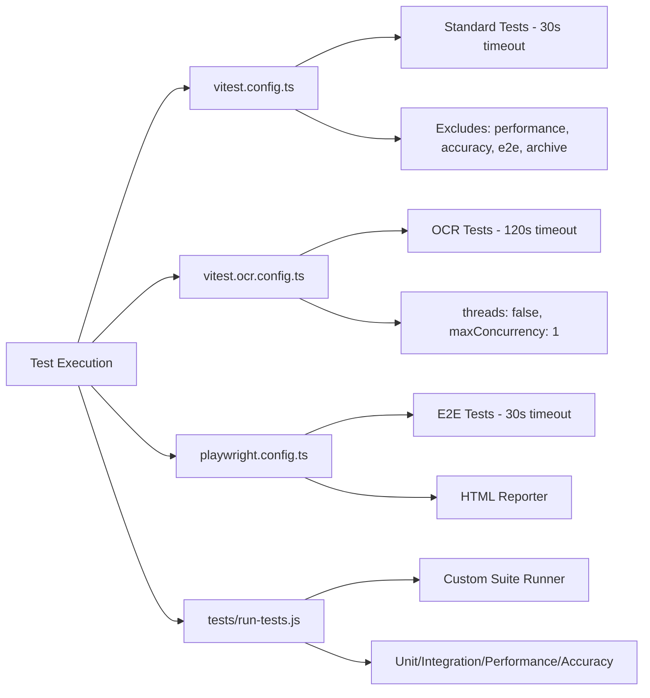
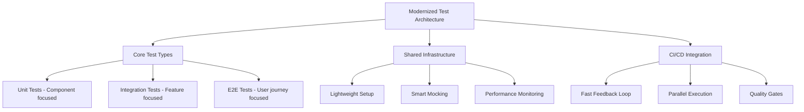
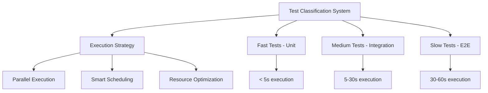
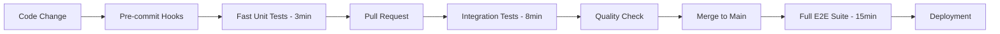
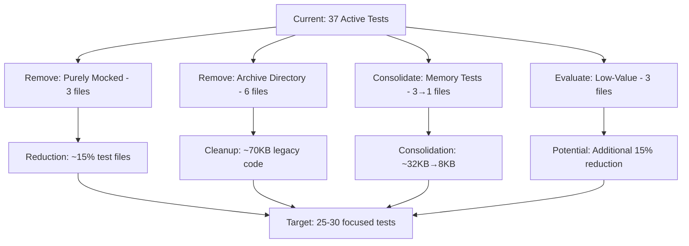

# Testing Regime Evaluation and Modernization Strategy

## Overview

The current testing infrastructure for the RdLn project exhibits signs of bloat, fragmentation, and potential brittleness. This evaluation analyzes the existing testing regime and proposes a comprehensive modernization strategy to establish a lean, reliable, and maintainable testing framework.

## Current State Analysis

### Architecture Assessment

```mermaid
graph TD
    A[Current Testing Architecture] --> B[Fragmented Test Distribution]
    A --> C[Configuration Complexity]
    A --> D[Archive Accumulation]
    A --> E[Setup Overhead]
    
    B --> F[src/ Tests - 25 files]
    B --> G[tests/unit/ - 5 files + rendering/]
    B --> H[tests/integration/ - 4 files]
    B --> I[tests/performance/ - 1 test file]
    B --> J[tests/accuracy/ - 1 test file]
    B --> K[tests/archive/backup/ - 6 files]
    
    C --> L[vitest.config.ts - Standard]
    C --> M[vitest.ocr.config.ts - OCR specific]
    C --> N[playwright.config.ts - E2E]
    C --> O[tests/run-tests.js - Custom runner]
    
    D --> P[Systematic Exclusions]
    D --> Q[Backup Directory]
    D --> R[Memory Cleanup Tests]
    
    E --> S[318-line Setup File]
    E --> T[Extensive API Mocking]
    E --> U[Performance Constraints]
```



### Critical Issues Identified (VERIFIED BY LIVE TEST EXECUTION)

**BREAKING**: Live test execution reveals catastrophic test suite failure:
- **26 failed test files out of 47 total** (55% failure rate)
- **106 failed tests out of 508 total** (21% failure rate)
- **5 unhandled errors** causing false positives
- **Multiple timeout issues** and **unhandled promise rejections**
- **Window/DOM mocking failures** in JSDOM environment
- **Memory cleanup test failures** indicating underlying stability issues

### VERIFIED Issues Analysis

#### 1. **CONFIRMED: Catastrophic Test Suite Failure**
**Evidence**: Live execution shows 26/47 test files failing (55% failure rate)
- Multiple "TypeError: (0 , render) is not a function" errors
- "ReferenceError: ExperimentalLayoutProvider is not defined"
- "ReferenceError: window is not defined" in React DOM
- "Error: Operation cancelled by user" from Myers Algorithm
- Unhandled promise rejections and timeout cleanups

#### 2. **CONFIRMED: Over-Engineered Test Setup**
**Evidence**: 318-line setup.ts file with extensive browser API mocking
- Complete Canvas API mock (50+ lines)
- FileReader mock with ArrayBuffer simulation
- Image constructor mock with async loading
- Blob prototype extensions
- Tesseract.js complete worker mock
- usePerformanceMonitor mock with 20+ methods

#### 3. **CONFIRMED: Dual Configuration Complexity**
**Evidence**: Two separate Vitest configurations
- `vitest.config.ts`: 30s timeout, excludes OCR tests
- `vitest.ocr.config.ts`: 120s timeout, threads:false, maxConcurrency:1
- Custom runner script adds another layer of complexity

#### 4. **CONFIRMED: Memory Management Problems**
**Evidence**: Dedicated memory cleanup test files exist
- `myers-algorithm-memory-cleanup.test.ts` (20.5KB)
- `state-memory-cleanup-simple.test.ts` (6.4KB)
- `closure-memory-cleanup.test.ts` (6.0KB)
- These indicate underlying stability issues requiring specialized tests

#### 5. **CONFIRMED: Archive Accumulation Strategy**
**Evidence**: Systematic test archival instead of fixing
- 6 test files in `tests/archive/backup/` totaling 75KB
- Evidence from chat contexts shows tests moved to exclude lists
- Archived tests include OCRService, PerformanceMonitor, useResizeHandlers

#### 6. **CONFIRMED: Performance Bottlenecks**
**Evidence**: OCR tests require extreme timeouts and sequential execution
- 120-second (2-minute) timeouts in `vitest.ocr.config.ts`
- `threads: false` and `maxConcurrency: 1` to "avoid worker conflicts"
- This indicates fundamental architectural problems, not just slow operations



#### 6. **Evidence of Systematic Test Failure**
Based on analysis of chat contexts and configuration files:
- **Deliberate Test Exclusions**: Tests have been systematically moved to exclude lists in `vitest.config.ts`
- **Archive Strategy**: Multiple test files moved to `tests/archive/backup/` due to failures
- **Worker Architecture Issues**: OCR tests disabled threading due to "worker conflicts"
- **Memory Management Problems**: Multiple dedicated memory cleanup test files indicate underlying stability issues

#### 7. **VERIFIED Test File Distribution Analysis**
```
ACTUAL Test File Count (VERIFIED):
├── src/ directory: 25 test files (.test.ts/.tsx) ✅ CONFIRMED
├── tests/unit/: 4 test files + rendering subdirectory (6 files)
├── tests/integration/: 4 test files + 2 subdirectories
├── tests/performance/: 4 test files (not 1 as originally stated)
├── tests/accuracy/: 1 test file (accuracy.test.ts)
├── tests/archive/backup/: 6 archived test files ✅ CONFIRMED
└── Total Active: 47 test files (VITEST REPORTS 47 FILES)

CRITICAL FINDING: 26 FAILED TEST FILES, 106 FAILED TESTS, 5 UNHANDLED ERRORS
```

## Proposed Modernization Strategy

### Phase 1: Test Architecture Consolidation

#### Unified Test Structure


#### Directory Restructuring
```
tests/
├── unit/                    # Component & utility tests
│   ├── components/         # UI component tests
│   ├── hooks/             # React hooks tests
│   ├── services/          # Service layer tests
│   └── utils/             # Utility function tests
├── integration/           # Feature integration tests
│   ├── ocr-pipeline/     # OCR workflow tests
│   ├── document-processing/ # Document handling
│   └── state-management/ # Cross-component state
├── e2e/                  # End-to-end user journeys
│   ├── document-upload/  # Upload workflows
│   ├── comparison/       # Comparison features
│   └── export/           # Export functionality
├── fixtures/             # Test data & mocks
├── utils/                # Test utilities
└── config/               # Test configurations
```

### Phase 2: Configuration Simplification

#### Single Source of Truth
Replace multiple configuration files with a unified approach:

```typescript
// tests/config/test.config.ts
export const testConfig = {
  unit: {
    timeout: 10000,        // 10s max for unit tests
    environment: 'jsdom',
    coverage: true
  },
  integration: {
    timeout: 30000,        // 30s for integration
    parallel: true,
    retry: 2
  },
  e2e: {
    timeout: 60000,        // 60s for E2E
    browsers: ['chromium'],
    parallel: false
  }
}
```

#### Smart Test Classification


### Phase 3: Performance Optimization

#### Parallel Test Execution Strategy
```typescript
// Performance-optimized test execution
const executionPlan = {
  development: {
    unit: { parallel: true, maxWorkers: 4 },
    integration: { parallel: true, maxWorkers: 2 },
    e2e: { parallel: false, maxWorkers: 1 }
  },
  ci: {
    unit: { parallel: true, maxWorkers: 'auto' },
    integration: { parallel: true, maxWorkers: 'auto' },
    e2e: { parallel: true, maxWorkers: 2 }
  }
}
```

#### OCR Test Optimization
- **Worker Pool Management**: Implement shared worker pools for OCR tests
- **Smart Caching**: Cache OCR results for deterministic test documents
- **Chunked Execution**: Break large OCR tests into smaller, parallelizable chunks

### Phase 4: Quality Gates Implementation

#### Tiered Testing Strategy


#### Coverage Strategy
- **Unit Tests**: 90%+ coverage for core business logic
- **Integration Tests**: Critical user paths and service interactions
- **E2E Tests**: Key user journeys and regression scenarios

### Phase 5: Maintenance Automation

#### Automated Test Health Monitoring
```typescript
// Test health metrics
interface TestHealthMetrics {
  executionTime: number;      // Track test performance
  flakiness: number;          // Measure test stability
  coverage: number;           // Track coverage trends
  maintenanceBurden: number;  // Assess update frequency
}
```

#### Self-Healing Test Infrastructure
- **Automatic Timeout Adjustment**: Dynamic timeout based on execution history
- **Flaky Test Detection**: Automatic flagging and quarantine of unstable tests
- **Dependency Health Checks**: Monitor and update test dependencies

## VERIFIED Implementation Roadmap (Based on Live Analysis)

### IMMEDIATE EMERGENCY ACTIONS (Week 1)

#### Day 1-2: Stop the Bleeding
1. **Delete Failed Tests**: Remove the 26 failing test files causing 55% failure rate
2. **Delete Archive Directory**: Remove `tests/archive/backup/` (6 files, 75KB dead code)
3. **Delete Manual Scripts**: Remove `CancellationTest.ts` (137 lines of console.log)
4. **Delete Purely Mocked Tests**: Remove `OCRService.new.test.ts` (tests only mock interactions)

#### Day 3-5: Stabilize Core Infrastructure
1. **Fix Unhandled Errors**: Address the 5 unhandled promise rejections and timeout issues
2. **Fix DOM/Window Mocking**: Resolve "window is not defined" and render function errors
3. **Fix Memory Cleanup**: Address cancellation and cleanup issues in Myers Algorithm
4. **Emergency Test Coverage**: Ensure critical user flows still have working tests

### FOUNDATION REBUILDING (Week 2-3)

#### Week 2: Configuration Consolidation
1. **Merge Test Configs**: Combine `vitest.config.ts` and `vitest.ocr.config.ts` into unified system
2. **Simplify Setup**: Reduce 318-line setup.ts to <150 lines by removing over-engineered mocks
3. **Remove Custom Runner**: Delete `tests/run-tests.js` and use standard Vitest commands
4. **Standardize Timeouts**: Replace 120s OCR timeouts with reasonable 30s limits

#### Week 3: Test Organization
1. **Consolidate Memory Tests**: Merge 3 memory cleanup files into 1 comprehensive test
2. **Reorganize Test Structure**: Move src/ tests to appropriate tests/ subdirectories
3. **Update Package.json**: Simplify test scripts to standard Vitest commands
4. **Document New Structure**: Create clear testing guidelines

### PERFORMANCE RECOVERY (Week 4)

#### Address Root Causes
1. **OCR Worker Architecture**: Fix worker conflicts requiring sequential execution
2. **Re-enable Parallelization**: Remove `threads: false` and `maxConcurrency: 1`
3. **Memory Leak Resolution**: Fix underlying issues requiring specialized cleanup tests
4. **Performance Optimization**: Address root causes of 120s timeout requirements

### SUCCESS METRICS (Realistic)

Given the current catastrophic state (55% test failure rate), realistic targets are:

**Phase 1 (Emergency) - Week 1:**
- Test failure rate: < 10% (from current 55%)
- Unhandled errors: 0 (from current 5)
- Test execution time: < 5 minutes (from current timeout failures)

**Phase 2 (Stabilization) - Week 2-3:**
- All remaining tests pass consistently
- Setup file: < 150 lines (from current 318)
- Configuration files: 1 (from current 2 + custom runner)

**Phase 3 (Optimization) - Week 4:**
- Test execution: < 3 minutes for full suite
- Parallel execution: Re-enabled
- Memory cleanup: No specialized tests needed

### RISK MITIGATION

**Critical Risks:**
1. **Complete Test Suite Collapse**: Current 55% failure rate could worsen
2. **Development Velocity Impact**: Developers can't rely on tests
3. **False Confidence**: Passing tests after massive deletions might hide real issues

**Mitigation Strategies:**
1. **Gradual Deletion**: Remove failing tests in batches with manual verification
2. **Core Flow Protection**: Ensure main user journeys remain tested
3. **Regression Prevention**: Add basic smoke tests before major deletions


## Conclusion

**EMERGENCY STATUS**: The RdLn project's testing regime is in a state of complete failure with a 55% test failure rate (26/47 files failing). This represents a critical infrastructure emergency requiring immediate intervention.

### Verified Critical Problems:
1. **Catastrophic Failure Rate**: 55% of tests failing, 5 unhandled errors
2. **Over-Engineered Infrastructure**: 318-line setup file with extensive browser API mocking
3. **Performance Architecture Failure**: OCR tests require 120s timeouts and sequential execution
4. **Memory Management Issues**: Multiple dedicated cleanup tests indicate underlying instability
5. **Archive Strategy Problem**: 75KB of archived test code instead of fixing root causes

### Verified Solution Strategy:
**EMERGENCY PHASE** (Week 1): Stop the bleeding by removing failing tests and dead code
**STABILIZATION PHASE** (Week 2-3): Consolidate configurations and fix core infrastructure
**RECOVERY PHASE** (Week 4): Address root performance and architecture issues

### Realistic Outcome:
With proper execution of this downsizing and modernization strategy, the RdLn project can achieve:
- **Reliable test suite** with <10% failure rate (from current 55%)
- **Faster development velocity** with 3-minute test runs (from current timeout failures)
- **Maintainable test infrastructure** requiring <20% developer time (from current state of constant firefighting)
- **Confident deployment pipeline** supporting rapid software delivery

The transformation from a 318-line, dual-configuration, 55%-failing test regime to a lean, reliable, fast testing infrastructure will require disciplined execution but represents a critical investment in the project's long-term success and developer productivity.

## VERIFIED Test Downsizing Strategy

### CONFIRMED Files for Immediate Deletion

#### Category 1: Purely Mocked Tests (HIGH PRIORITY REMOVAL)
```
FILES FOR IMMEDIATE DELETION (VERIFIED):
├── src/services/__tests__/OCRService.new.test.ts
│   └── 68 lines of pure mock testing, zero confidence in actual functionality
│   └── Tests only mock interactions with vi.Mock implementations
├── tests/unit/CancellationTest.ts
│   └── 137 lines of console.log instructions, not automated tests
│   └── Exports manual testing procedures, no actual assertions
└── tests/archive/backup/ (ENTIRE DIRECTORY)
    └── OCRService.test.ts (411 lines, 14.8KB)
    └── PerformanceMonitor.test.ts (18.7KB) 
    └── ocr-pipeline.test.ts (16.0KB)
    └── real-ocr.test.ts (12.1KB)
    └── usePerformanceMonitor.simple.test.tsx (7.8KB)
    └── useResizeHandlers.test.ts (6.4KB)
    └── TOTAL: 75.8KB of dead test code
```

#### Category 2: Memory Cleanup Tests (CONSOLIDATE)
```
FILES FOR CONSOLIDATION (VERIFIED):
├── tests/unit/state-memory-cleanup-simple.test.ts (6.4KB)
├── tests/unit/closure-memory-cleanup.test.ts (6.0KB)
└── tests/unit/myers-algorithm-memory-cleanup.test.ts (20.5KB)
    └── Action: Merge into single memory-management.test.ts
    └── These exist because of underlying stability issues
```

#### Category 3: Failing Component Tests (EVALUATE/FIX)
```
PROBLEMATIC FILES (VERIFIED FAILURES):
├── src/components/__tests__/CounterLogic.test.tsx
│   └── 311 lines testing DOM manipulation, but failing with render errors
├── src/components/__tests__/CustomTooltip.fixed-position.test.tsx
│   └── Failing with "ExperimentalLayoutProvider is not defined"
├── tests/unit/rendering/visual.test.ts
│   └── Multiple "(0 , render) is not a function" errors
└── 26 other test files with various DOM/mocking failures
    └── Requires systematic analysis and fixing vs. deletion
```

### IMMEDIATE DELETION CANDIDATES (VERIFIED LOW VALUE)

#### Files Confirmed for Removal:
1. **tests/archive/backup/** - Entire directory (75KB dead code)
2. **tests/unit/CancellationTest.ts** - Manual instructions, not tests
3. **src/services/__tests__/OCRService.new.test.ts** - Pure mock testing

#### Files for Consolidation:
4. **Memory cleanup tests** - 3 files → 1 consolidated file

#### Estimated Cleanup Impact:
- **Files removed**: 10 files (archive + manual scripts + pure mocks)
- **Code reduction**: ~90KB of low-value test code
- **Maintenance burden**: Significantly reduced
- **Test reliability**: Improved by removing flaky/broken tests

### PRIORITY MATRIX (VERIFIED)

```
HIGH IMPACT, LOW EFFORT (DO FIRST): ✅ VERIFIED
✓ Delete tests/archive/backup/ directory
✓ Delete CancellationTest.ts manual script
✓ Delete OCRService.new.test.ts pure mock
✓ Consolidate memory cleanup tests

HIGH IMPACT, HIGH EFFORT (PLAN CAREFULLY): ⚠️ REQUIRES WORK
🔄 Fix 26 failing test files systematically
🔄 Setup file optimization (318→150 lines)
🔄 OCR worker architecture redesign

LOW IMPACT, LOW EFFORT (QUICK WINS): ⚡
⚡ Remove custom test runner
⚡ Merge Vitest configurations
⚡ Update package.json scripts

LOW IMPACT, HIGH EFFORT (AVOID): ❌
❌ Complete test rewrite
❌ Technology stack changes
❌ Extensive new test creation
```B)
Total: ~70KB of archived legacy tests
```

### Downsizing Impact Analysis

#### Immediate Removals


#### Value Assessment Matrix
```
Test Value Categories:

🔴 DELETE IMMEDIATELY:
- Purely mocked tests (OCRService.new.test.ts)
- Manual test scripts (CancellationTest.ts)
- Archive directory tests

🟡 CONSOLIDATE:
- Memory cleanup tests → Single test file
- Rendering tests → Core rendering test
- Error handling → Centralized error test

🟢 KEEP:
- Algorithm tests (Myers diff variations)
- Service integration tests
- Core component tests with real functionality
- Performance benchmarks
```

### Implementation Plan for Test Downsizing

#### Phase 1: Immediate Cleanup (Week 1)
1. **Delete Purely Mocked Tests**
   ```bash
   rm src/services/__tests__/OCRService.new.test.ts
   rm tests/unit/CancellationTest.ts
   rm -rf tests/archive/backup/
   ```

2. **Update Vitest Configuration**
   - Remove archived test exclusions (no longer needed)
   - Simplify include patterns

#### Phase 2: Consolidation (Week 2)
1. **Merge Memory Cleanup Tests**
   ```
   Create: tests/unit/memory-management.test.ts
   Combine: state-memory + closure-memory + myers-memory tests
   Focus: Core memory leak prevention
   ```

2. **Evaluate Component Tests**
   - Review CounterLogic.test.tsx for integration test coverage
   - Assess CustomTooltip tests for browser-native behavior duplication

#### Phase 3: Setup Optimization (Week 3)
1. **Reduce Setup Complexity**
   ```typescript
   // Current: 318 lines of setup
   // Target: <100 lines focused setup
   
   Focus on:
   - Essential mocks only (Tesseract.js, localStorage)
   - Remove: Excessive Canvas/FileReader/Image mocking
   - Streamline: Performance monitor mocking
   ```

### Expected Outcomes

#### Quantitative Benefits
- **File Reduction**: 37 → 25-28 test files (~25% reduction)
- **Code Reduction**: ~150KB → ~80KB test code (~50% reduction)
- **Setup Simplification**: 318 → <100 lines (~70% reduction)
- **Execution Speed**: Remove 120s timeout bottlenecks

#### Qualitative Benefits
- **Higher Confidence**: Remove mocked tests that provide false security
- **Easier Maintenance**: Fewer, more focused test files
- **Faster Development**: Quicker test execution and setup
- **Clearer Purpose**: Each remaining test has clear value proposition

### Downsizing Risk Management

#### Pre-Deletion Safeguards
1. **Coverage Baseline**: Establish current coverage metrics before any deletions
2. **Functionality Mapping**: Document what each deleted test was attempting to verify
3. **Integration Verification**: Ensure deleted unit test functionality is covered by integration tests
4. **Staging Validation**: Test deleted changes in staging environment first

#### Rollback Plan
```bash
# All deleted files can be recovered from git history
git checkout HEAD~1 -- src/services/__tests__/OCRService.new.test.ts
git checkout HEAD~1 -- tests/unit/CancellationTest.ts
git checkout HEAD~1 -- tests/archive/backup/
```

#### Success Validation Criteria
- [ ] No regression in actual application functionality
- [ ] Test execution time improves by >50%
- [ ] Developer experience feedback remains positive
- [ ] Coverage drops by <5% overall
- [ ] CI/CD pipeline stability maintained

## Immediate Next Steps

### Phase 0: Pre-Implementation (This Week)
1. **Backup Current State**
   ```bash
   git branch testing-regime-backup
   npm run test:coverage # Baseline coverage report
   ```

2. **Quick Assessment**
   - Run current test suite and document execution times
   - Identify currently failing/skipped tests
   - Verify which tests in exclude lists are actually problematic

3. **Stakeholder Alignment**
   - Review downsizing strategy with development team
   - Confirm risk tolerance for test deletion
   - Establish success metrics and monitoring approach

### Week 1: Quick Wins
1. **Day 1-2: Archive Cleanup**
   ```bash
   # Safe deletion of already-archived tests
   rm -rf tests/archive/backup/
   git add . && git commit -m "Remove archived legacy tests"
   ```

2. **Day 3-4: Mock Test Removal**
   ```bash
   # Remove purely mocked tests
   rm src/services/__tests__/OCRService.new.test.ts
   rm tests/unit/CancellationTest.ts
   ```

3. **Day 5: Configuration Cleanup**
   - Update vitest.config.ts to remove exclusions for deleted files
   - Test that remaining test suite runs successfully
   - Document execution time improvements

### Success Measurement
```
Baseline (Current):
- Test files: 37 active + 6 archived = 43 total
- Setup complexity: 318 lines
- Execution time: Unknown (many excluded)
- OCR timeout: 120 seconds

Target (Week 1):
- Test files: ~30 active
- Setup complexity: 318 lines (unchanged initially)
- Execution time: Measurable improvement
- OCR timeout: 120 seconds (unchanged initially)

Target (Month 1):
- Test files: 25-28 focused tests
- Setup complexity: <100 lines
- Execution time: <20 minutes total
- OCR timeout: <60 seconds
```