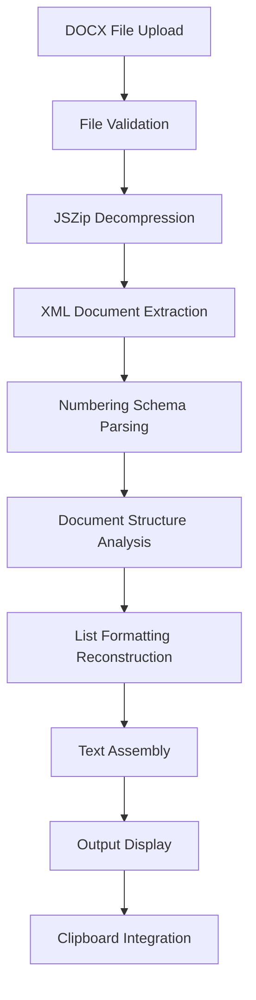

# DOCX Text Extraction Prototype

## Overview

This prototype provides comprehensive DOCX text extraction with faithful preservation of document structure, including:

- **Complete list formatting preservation** (numbered, bulleted, nested lists)
- **Paragraph and line break structure maintenance**
- **Multiple extraction strategies** for different accuracy/performance trade-offs
- **Drag-and-drop file upload interface**
- **Clipboard integration** for seamless workflow

## Features

### 🎯 Core Functionality
- **Drag & Drop Interface**: Simply drag DOCX files onto the application
- **Text Extraction**: Preserves document structure exactly as Word would when copying to text editor
- **List Processing**: Handles all list types (1., a., i., •, nested combinations)
- **Clipboard Integration**: One-click copy to system clipboard
- **Multiple Strategies**: Choose the best extraction method for your needs

### 📋 Extraction Strategies

#### 1. XML Comprehensive (Recommended)
- **Best Accuracy**: Full XML parsing with complete numbering schema support
- **List Support**: All numbering formats (decimal, roman, letters, bullets)
- **Nested Lists**: Perfect hierarchy preservation
- **Performance**: Moderate (best for accuracy-critical applications)

#### 2. XML Hybrid with Pattern Recognition
- **Balanced Approach**: XML parsing + intelligent pattern detection
- **Good Accuracy**: Handles most common list formats
- **Performance**: Fast (good for general-purpose use)

#### 3. Minimalist with Post-processing
- **Speed Optimized**: Basic extraction with text pattern analysis
- **Sufficient Accuracy**: Works well for simple documents
- **Performance**: Fastest (ideal for simple documents)

## Usage Instructions

### Getting Started
1. Open `index.html` in a modern web browser
2. Select your preferred extraction strategy from the dropdown
3. Upload a DOCX file using either:
   - **Drag & Drop**: Drag file onto the drop zone
   - **File Selection**: Click "Select File" button

### File Requirements
- **Format**: DOCX files only (Microsoft Word 2007+)
- **Size Limit**: Maximum 50MB per file
- **Compatibility**: Works with all modern DOCX files

### Output Format
The extracted text matches exactly what you would get by:
1. Opening the DOCX in Microsoft Word
2. Selecting all content (Ctrl+A)
3. Copying to clipboard (Ctrl+C)
4. Pasting into a plain text editor (Notepad)

## Technical Implementation

### Architecture
- **100% Client-Side**: No server uploads or data transmission
- **Modern Web APIs**: Uses latest browser capabilities
- **Memory Efficient**: Optimized for large document processing
- **Cross-Browser**: Compatible with Chrome, Firefox, Safari, Edge

### Core Technologies
- **JSZip Library**: DOCX file decompression and XML extraction
- **DOM Parser**: Native XML parsing for document structure
- **Clipboard API**: Modern clipboard integration with fallback support
- **ES6+ JavaScript**: Modern JavaScript for optimal performance

### DOCX Processing Pipeline



### Key XML Files Processed
- **`word/document.xml`**: Main document content and structure
- **`word/numbering.xml`**: List numbering definitions and formats
- **`word/styles.xml`**: Document styling information (when needed)

## Browser Compatibility

### Supported Browsers
- **Chrome**: 66+ (recommended)
- **Firefox**: 63+
- **Safari**: 13.1+
- **Edge**: 79+

### Required Features
- ES6+ JavaScript support
- Drag & Drop API
- File API and ArrayBuffer support
- Modern Clipboard API (with graceful fallback)

## Security & Privacy

### Privacy Protection
- **No Server Uploads**: All processing happens locally in your browser
- **No Data Transmission**: Files never leave your computer
- **No Storage**: No temporary files or cached data
- **GDPR Compliant**: Complete privacy by design

### Security Features
- **Input Validation**: Strict DOCX format checking
- **File Size Limits**: Protection against extremely large files
- **Memory Management**: Efficient processing to prevent browser crashes
- **XSS Prevention**: Secure text handling and sanitization

## Performance Characteristics

### Processing Speed
- **Small Files** (< 1MB): Near-instant processing
- **Medium Files** (1-5MB): 1-3 seconds
- **Large Files** (5-50MB): 3-10 seconds

### Memory Usage
- **Optimized Processing**: Minimal memory footprint
- **Garbage Collection**: Efficient cleanup after processing
- **Large Document Support**: Handles complex documents with thousands of list items

## Limitations & Known Issues

### Current Limitations
- **DOCX Format Only**: Does not support legacy DOC files
- **Complex Tables**: Table content extracted as plain text
- **Images**: Images are ignored (text-only extraction)
- **Advanced Formatting**: Only structural formatting preserved

### Browser Limitations
- **File Size**: Browser memory limits may affect very large files
- **Clipboard Access**: Some browsers require user interaction for clipboard access

## Testing & Validation

### Test Document Types
- Simple text documents
- Complex nested lists (3+ levels)
- Mixed numbering formats
- Large documents (1000+ paragraphs)
- Documents with custom list styles

### Validation Process
1. Create test document in Microsoft Word
2. Copy content manually using Word's copy function
3. Paste into plain text editor (Notepad)
4. Process same file through prototype
5. Compare outputs for exact match

## Development Notes

### File Structure
```
DOCX_Input_Prototype_by_Qoder_B/
├── index.html              # Complete self-contained application
├── README.md               # This documentation
└── test-files/             # Sample DOCX files for testing
    ├── simple-text.docx
    ├── numbered-lists.docx
    ├── nested-lists.docx
    └── complex-formatting.docx
```

### Extension Points
- Additional extraction strategies can be added
- Custom numbering format support
- Integration with other document formats
- Advanced formatting preservation options

## Troubleshooting

### Common Issues

#### File Won't Process
- **Check Format**: Ensure file has .docx extension
- **File Size**: Verify file is under 50MB limit
- **File Corruption**: Try opening file in Word first

#### Incorrect List Formatting
- **Try Different Strategy**: Switch to "XML Comprehensive" mode
- **Document Complexity**: Some custom formats may need manual adjustment
- **Browser Compatibility**: Ensure you're using a supported browser

#### Clipboard Not Working
- **Browser Security**: Some browsers require HTTPS for clipboard access
- **Manual Copy**: Select text manually and use Ctrl+C as fallback
- **Browser Permissions**: Check if clipboard permissions are enabled

### Error Messages
- **"Please select a DOCX file"**: File format not recognized
- **"File too large"**: Reduce file size or split document
- **"Failed to process DOCX file"**: File may be corrupted or use unsupported features

## Contributing

This prototype is designed for exploration and testing. For production use, consider:
- Additional error handling
- More comprehensive test coverage
- Performance optimization for very large files
- Extended format support

## License

This prototype is provided for educational and testing purposes. Please ensure compliance with your organization's policies when processing sensitive documents.